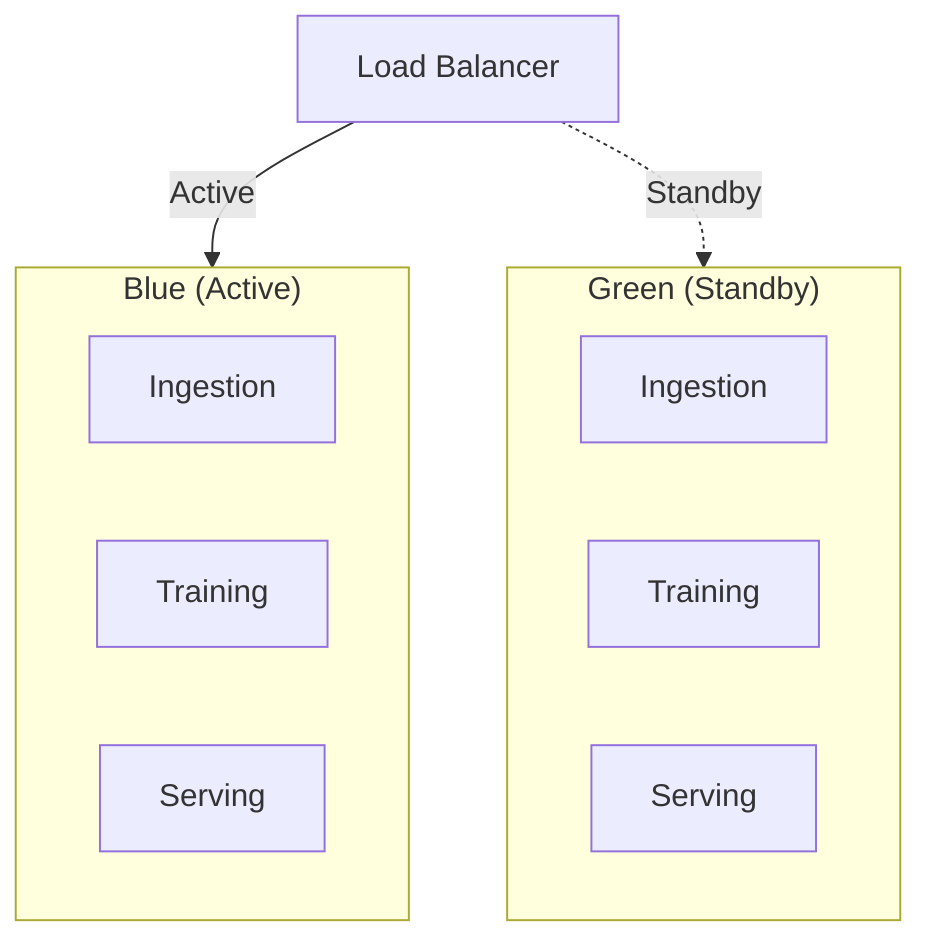
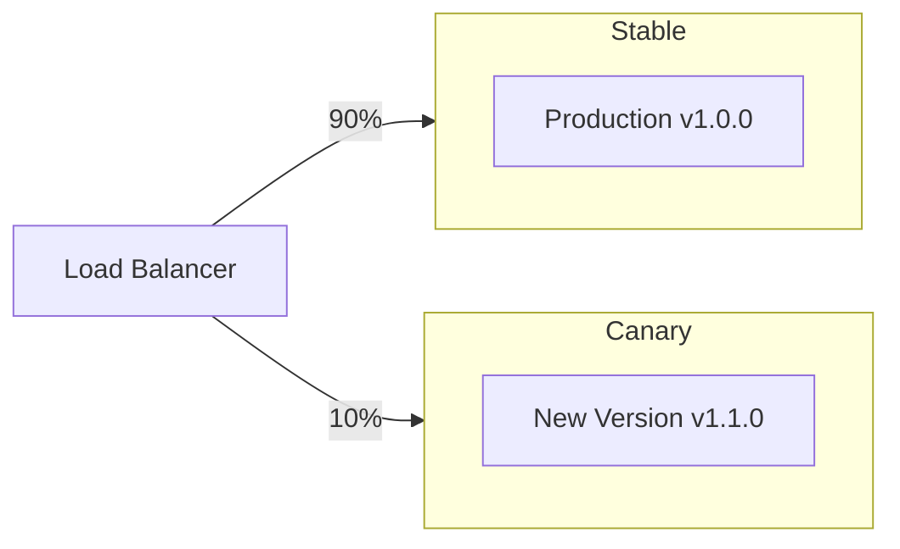

# SOFARE-AI: MLOps Pipeline untuk Prediksi Harga Cryptocurrency


SOFARE-AI adalah sistem MLOps (Machine Learning Operations) end-to-end yang komprehensif untuk prediksi harga cryptocurrency. Sistem ini mengimplementasikan praktik terbaik MLOps modern dengan fokus pada reliability, scalability, dan automated operations dalam production environment.

## 🎯 Overview MLOps

SOFARE-AI mengikuti framework MLOps yang mencakup seluruh lifecycle machine learning:

- **Data Engineering:** Multi-modal data ingestion dan processing
- **Model Development:** Automated training dengan hyperparameter tuning
- **Model Deployment:** Zero-downtime deployment dengan canary strategies
- **Model Monitoring:** Real-time drift detection dan performance monitoring
- **Model Governance:** Version control, rollback, dan audit trails


## 🏗️ Arsitektur Sistem

### Microservices Architecture

```
┌─────────────────┐    ┌─────────────────┐    ┌─────────────────┐
│   Ingestion     │    │    Training     │    │    Serving      │
│   Service       │◄──►│    Service      │◄──►│    Service      │
│                 │    │                 │    │                 │
│ • Binance WS    │    │ • SofareM3      │    │ • FastAPI        │
│ • Yahoo Finance │    │ • PyTorch       │    │ • Dashboard      │
│ • FRED API      │    │ • MLflow        │    │ • Real-time API  │
└─────────────────┘    └─────────────────┘    └─────────────────┘
       │                       │                       │
       └───────────────────────┼───────────────────────┘
                               │
                    ┌─────────────────┐
                    │   MLflow UI     │
                    │   (Port 5000)   │
                    └─────────────────┘
```


## ML Canvas SOFARE-AI

### 1. Background (Latar Belakang)
SOFARE-AI adalah sistem machine learning berbasis microservices untuk prediksi harga cryptocurrency. Sistem ini mengintegrasikan data multi-modal termasuk data OHLCV pasar crypto, indikator makroekonomi, dan performa aset safe-haven untuk melatih model deep learning canggih.

**Kontekst Bisnis:**
- Prediksi harga cryptocurrency merupakan tantangan kompleks karena volatilitas tinggi
- Data pasar crypto tersedia real-time namun sangat noise
- Faktor eksternal seperti kebijakan moneter dan sentimen pasar global sangat berpengaruh
- Kebutuhan akan sistem yang dapat beradaptasi dengan perubahan pasar yang cepat

**Masalah yang Dihadapi:**
- Data leakage dalam time-series modeling
- Drift data yang menyebabkan model menjadi outdated
- Kesulitan dalam deployment dan monitoring model ML di production
- Kurangnya sistem versioning dan rollback yang robust

### 2. Value Proposition (Proposisi Nilai)
SOFARE-AI memberikan nilai melalui:

**Untuk Data Scientist/ML Engineer:**
- Pipeline MLOps lengkap dengan automated training dan deployment
- Sistem drift detection otomatis untuk memastikan model tetap akurat
- Experiment tracking dengan MLflow untuk reproducibility
- Hyperparameter tuning otomatis dengan Optuna

**Untuk Business/Stakeholder:**
- Prediksi harga crypto yang akurat untuk decision making
- Sistem monitoring real-time untuk model performance
- Dashboard interaktif untuk visualisasi prediksi
- Reliability tinggi dengan automated rollback

**Untuk Developer:**
- Arsitektur microservices yang scalable
- API RESTful untuk easy integration
- Containerized deployment dengan Docker
- Dokumentasi lengkap dan best practices

### 3. Objective (Tujuan)
**Tujuan Utama:**
Membangun sistem ML yang dapat memprediksi harga cryptocurrency dengan akurasi >55% dan mampu beradaptasi otomatis terhadap perubahan kondisi pasar.

**Tujuan Spesifik:**
- Mengumpulkan dan memproses data multi-modal (OHLCV, macro, safe-haven)
- Melatih model deep learning yang robust terhadap market volatility
- Men-deploy model ke production dengan zero-downtime
- Memantau dan mendeteksi drift secara real-time
- Mengimplementasikan automated retraining dan rollback

**Success Metrics:**
- Model accuracy > 55% pada test set
- Latency prediction < 100ms
- Uptime system > 99.9%
- Mean Absolute Error (MAE) < 0.03 pada normalized price

### 4. Solution (Solusi)
SOFARE-AI mengimplementasikan solusi end-to-end MLOps dengan arsitektur microservices:

**Arsitektur Sistem:**
```
┌─────────────────┐    ┌─────────────────┐    ┌─────────────────┐
│   Ingestion     │    │    Training     │    │    Serving      │
│   Service       │◄──►│    Service      │◄──►│    Service      │
│                 │    │                 │    │                 │
│ • Binance WS    │    │ • SofareM3      │    │ • FastAPI        │
│ • Yahoo Finance │    │ • PyTorch       │    │ • Dashboard      │
│ • FRED API      │    │ • MLflow        │    │ • Real-time API  │
└─────────────────┘    └─────────────────┘    └─────────────────┘
       │                       │                       │
       └───────────────────────┼───────────────────────┘
                               │
                    ┌─────────────────┐
                    │   MLflow UI     │
                    │   (Port 5000)   │
                    └─────────────────┘
```

**Teknologi Stack:**
- **Data Processing:** Pandas, NumPy, TA-Lib
- **ML Framework:** PyTorch dengan custom architecture
- **MLOps Tools:** MLflow, Optuna, Docker
- **Serving:** FastAPI, Uvicorn
- **Orchestration:** Docker Compose, Kubernetes (opsional)
- **Monitoring:** Custom drift detection, health checks

### 5. Data (Data)
**Sumber Data Multi-Modal:**

**Micro Data (OHLCV + Technical Indicators):**
- **Source:** Binance WebSocket API (real-time), Yahoo Finance (historical)
- **Features:** Open, High, Low, Close, Volume, 19+ TA indicators
- **Granularity:** Minute-level (1440 records/day)
- **Update Frequency:** Real-time untuk live trading

**Macro Data (Economic Indicators):**
- **Source:** FRED API (Federal Reserve Economic Data)
- **Features:** Fed Funds Rate, GDP, Inflation, Employment data
- **Granularity:** Daily (di-expand ke minute-level)
- **Update Frequency:** Daily updates

**Safe Haven Data (Market Assets):**
- **Source:** Yahoo Finance API
- **Features:** Gold (XAU/USD), DXY, S&P500, VIX, NASDAQ, Oil (WTI)
- **Granularity:** Minute-level
- **Update Frequency:** Market hours (real-time)

**Data Pipeline:**
```python
# Data flow dari ingestion ke training
def data_pipeline():
    # 1. Collect real-time data
    micro_data = binance_client.get_ohlcv()
    macro_data = fred_client.get_macro_indicators()
    safe_data = yahoo_client.get_safe_haven_assets()
    
    # 2. Expand daily macro to minute-level
    macro_minute = expand_to_minute_granularity(macro_data)
    
    # 3. Merge all modalities
    merged_data = merge_multimodal_data(micro_data, macro_minute, safe_data)
    
    # 4. Add technical indicators
    features_data = add_technical_indicators(merged_data)
    
    # 5. Save to shared CSV
    features_data.to_csv("data/ohlcv.csv", index=False)
```

**Data Quality Assurance:**
- Null value detection dan removal
- Duplicate timestamp filtering
- Temporal ordering validation
- Statistical outlier detection

### 6. Metrics (Metrik)
**Model Performance Metrics:**

**Primary Metrics:**
- **Classification Accuracy:** >55% untuk up/down prediction
- **Mean Absolute Error (MAE):** <0.03 pada normalized returns
- **Root Mean Square Error (RMSE):** <0.05 pada price prediction

**Secondary Metrics:**
- **R² Score:** >0.8 untuk regression task
- **Precision/Recall/F1-Score:** Balanced untuk classification
- **AUC-ROC:** >0.7 untuk binary classification

**Business Metrics:**
- **Prediction Latency:** <100ms per request
- **System Uptime:** >99.9%
- **Data Freshness:** <5 minutes delay
- **Drift Detection:** <1 hour response time

**MLOps Metrics:**
- **Training Time:** <30 minutes per experiment
- **Model Size:** <500MB untuk deployment
- **Memory Usage:** <4GB RAM per serving instance
- **CPU Utilization:** <70% during peak load

### 7. Evaluation (Evaluasi)
**Evaluation Strategy:**

**Temporal Split (Kritis untuk Time-Series):**
```python
# Temporal train/val/test split - TIDAK PERNAH shuffle!
TRAIN_RATIO = 0.7   # 70% historical data
VAL_RATIO = 0.15    # 15% recent data untuk tuning
TEST_RATIO = 0.15   # 15% future data untuk final evaluation

# Split berdasarkan waktu
train_end = int(len(data) * TRAIN_RATIO)
val_end = int(len(data) * (TRAIN_RATIO + VAL_RATIO))

train_data = data[:train_end]
val_data = data[train_end:val_end]
test_data = data[val_end:]
```

**Cross-Validation untuk Time-Series:**
- Time-series split dengan expanding window
- Rolling window validation untuk robustness
- Out-of-sample testing pada data terbaru

**Evaluation Pipeline:**
```python
def evaluate_model(model, test_data):
    model.eval()
    with torch.no_grad():
        predictions = model(test_data)
        
        # Classification metrics
        cls_accuracy = accuracy_score(test_data['target'], predictions['cls'])
        cls_precision = precision_score(test_data['target'], predictions['cls'])
        cls_recall = recall_score(test_data['target'], predictions['cls'])
        
        # Regression metrics
        mae = mean_absolute_error(test_data['returns'], predictions['reg'])
        rmse = mean_squared_error(test_data['returns'], predictions['reg']) ** 0.5
        r2 = r2_score(test_data['returns'], predictions['reg'])
        
        return {
            'cls_accuracy': cls_accuracy,
            'cls_precision': cls_precision,
            'cls_recall': cls_recall,
            'mae': mae,
            'rmse': rmse,
            'r2_score': r2
        }
```

**Model Selection Criteria:**
- Accuracy > 55% pada test set
- MAE < 0.03 pada normalized returns
- Tidak overfit (val loss ≈ test loss)
- Computational efficiency untuk serving

### 8. Modeling (Pemodelan)
**SofareM3 Architecture:**

**Multi-Modal Encoder Design:**
```python
class SofareM3(nn.Module):
    def __init__(self):
        # Micro Encoder (OHLCV + TA)
        self.micro_encoder = TransformerEncoder(
            input_dim=len(micro_features),
            hidden_size=128,
            num_layers=2,
            num_heads=4
        )
        
        # Macro Encoder (Economic indicators)
        self.macro_encoder = TCNEncoder(
            input_dim=len(macro_features),
            hidden_size=64,
            num_layers=3
        )
        
        # Safe Haven Encoder (Market assets)
        self.safe_encoder = TransformerEncoder(
            input_dim=len(safe_features),
            hidden_size=64,
            num_layers=2,
            num_heads=2
        )
        
        # Attention Fusion Layer
        self.fusion_layer = MultiHeadAttention(
            embed_dim=256,
            num_heads=8
        )
        
        # Multi-task Head
        self.classification_head = nn.Linear(256, 2)  # Up/Down
        self.regression_head = nn.Linear(256, 1)      # Return prediction
```

**Training Strategy:**

**Loss Function (Multi-Task Learning):**
```python
def multi_task_loss(cls_pred, reg_pred, cls_target, reg_target):
    cls_loss = F.cross_entropy(cls_pred, cls_target)
    reg_loss = F.huber_loss(reg_pred.squeeze(), reg_target, delta=1.0)
    
    # Weighted combination
    total_loss = 0.5 * cls_loss + 0.5 * reg_loss
    return total_loss, cls_loss, reg_loss
```

**Optimization:**
- **Optimizer:** AdamW dengan weight decay
- **Scheduler:** Cosine annealing dengan warmup
- **Regularization:** Dropout, LayerNorm, Early stopping
- **Batch Size:** 32-64 samples
- **Sequence Length:** 30-90 minutes

**Hyperparameter Tuning dengan Optuna:**
```python
def objective(trial):
    # Search space
    hidden_size = trial.suggest_int("hidden_size", 64, 192)
    learning_rate = trial.suggest_float("learning_rate", 1e-4, 1e-2, log=True)
    dropout = trial.suggest_float("dropout", 0.1, 0.4)
    num_layers = trial.suggest_int("num_encoder_layers", 1, 3)
    
    # Train model
    model = SofareM3(hidden_size=hidden_size, dropout=dropout, num_layers=num_layers)
    # ... training code ...
    
    return val_accuracy
```

### 9. Inference (Inferensi)
**Serving Architecture:**

**FastAPI Serving Service:**
```python
@app.post("/predict")
async def predict(request: PredictionRequest):
    # Load latest model
    model = load_model_from_registry()
    
    # Preprocess input data
    processed_data = preprocess_input(request.data)
    
    # Make prediction
    with torch.no_grad():
        prediction = model(processed_data)
    
    # Post-process results
    result = {
        "timestamp": request.timestamp,
        "prediction": {
            "direction": "up" if prediction['cls'] > 0.5 else "down",
            "confidence": float(prediction['cls']),
            "expected_return": float(prediction['reg'])
        },
        "model_version": get_current_model_version(),
        "latency_ms": time.time() - start_time
    }
    
    return result
```

**Real-time Inference Pipeline:**
1. **Data Ingestion:** Continuous data collection via WebSocket
2. **Feature Engineering:** Real-time TA calculation
3. **Model Inference:** Batch prediction dengan sliding window
4. **Result Caching:** Redis untuk frequently requested predictions
5. **API Response:** JSON dengan millisecond timestamps untuk ApexCharts

**Scalability Considerations:**
- **Horizontal Scaling:** Multiple serving instances behind load balancer
- **Model Optimization:** ONNX export untuk faster inference
- **Caching Strategy:** Prediction caching untuk repeated queries
- **Async Processing:** Non-blocking I/O untuk high throughput

## Operasi MLOps Detail

### Data Training Strategy

**Full Dataset vs Rolling Window:**
```python
# BEST PRACTICE: Full Dataset Training
USE_FULL_DATASET = True
TRAIN_RATIO = 0.7
VAL_RATIO = 0.15
TEST_RATIO = 0.15

# Temporal split - NO SHUFFLING!
train_data = data[:train_end]
val_data = data[train_end:val_end]
test_data = data[val_end:]
```

**Keuntungan Full Dataset:**
- ✅ Belajar dari semua pola historis termasuk black swan events
- ✅ Robust terhadap berbagai kondisi pasar
- ✅ Proper temporal validation
- ✅ Held-out test set untuk evaluasi objektif

### Deployment Strategies

**Blue-Green Deployment:**


**Canary Deployment:**


### Drift Detection

**Statistical Tests Implementation:**
```python
from training.src.drift_detector import DriftDetector

detector = DriftDetector(
    ks_threshold=0.05,
    psi_threshold=0.2,
    wasserstein_threshold=0.1
)

# Detect multivariate drift
result = detector.detect_multivariate_drift(current_data)
if result.drift_detected:
    if result.severity == DriftSeverity.CRITICAL:
        trigger_retraining(priority="high")
    elif result.severity == DriftSeverity.HIGH:
        schedule_retraining(delay_hours=24)
```

**Drift Types:**
- **Input Drift:** Perubahan distribusi feature
- **Prediction Drift:** Perubahan distribusi output
- **Concept Drift:** Perubahan relationship input-output
- **Performance Degradation:** Penurunan akurasi metrics

### Hyperparameter Tuning

**Optuna Integration:**
```python
import optuna

def objective(trial):
    # Architecture parameters
    hidden_size = trial.suggest_int("hidden_size", 64, 192)
    embed_dim = trial.suggest_categorical("embed_dim", [64, 128])
    num_heads = trial.suggest_int("num_heads", 4, 8)
    
    # Training parameters
    learning_rate = trial.suggest_float("learning_rate", 1e-4, 1e-2, log=True)
    batch_size = trial.suggest_categorical("batch_size", [32, 64])
    dropout = trial.suggest_float("dropout", 0.1, 0.4)
    
    # Train and evaluate
    model = SofareM3(hidden_size=hidden_size, embed_dim=embed_dim, ...)
    accuracy = train_and_evaluate(model, train_data, val_data)
    
    return accuracy

study = optuna.create_study(direction="maximize")
study.optimize(objective, n_trials=50)
```

### Rollback Strategies

**Automatic Rollback Triggers:**
```python
def check_and_rollback():
    # Check critical drift
    drift_result = detector.detect_multivariate_drift(current_data)
    if drift_result.severity == DriftSeverity.CRITICAL:
        manager.rollback()
        notify_team("Model rolled back due to critical drift")
        return True
    
    # Check performance degradation
    perf_result = detector.detect_performance_degradation(
        baseline_metrics, current_metrics, degradation_threshold=0.1
    )
    if perf_result.drift_detected:
        manager.rollback()
        notify_team("Model rolled back due to performance degradation")
        return True
    
    return False
```

**Rollback Procedures:**
1. **Emergency Rollback:** Immediate traffic switch untuk critical issues
2. **Planned Rollback:** Gradual traffic shift dengan monitoring
3. **Canary Rollback:** Reverse canary deployment
4. **Version Rollback:** Revert ke previous model version

### Semantic Versioning

**Version Format:** `MAJOR.MINOR.PATCH[-PRERELEASE][+BUILD]`

**Automatic Version Bump Rules:**
```python
def determine_version_bump(current_metrics, new_metrics, architecture_changed, features_changed):
    if architecture_changed or features_changed:
        return VersionBump.MAJOR
    elif new_metrics['accuracy'] > current_metrics['accuracy'] + 0.05:  # >5% improvement
        return VersionBump.MINOR
    else:
        return VersionBump.PATCH
```

**Version Lifecycle:**
- `DRAFT` → `CANDIDATE` → `RELEASED` → `DEPRECATED`/`ROLLED_BACK`

## Kesimpulan

SOFARE-AI merupakan implementasi lengkap MLOps untuk prediksi harga cryptocurrency dengan fokus pada:

1. **Data Quality:** Multi-modal data integration dengan proper temporal handling
2. **Model Robustness:** Full dataset training dengan temporal validation
3. **Production Reliability:** Comprehensive deployment dan monitoring strategies
4. **Automated Adaptation:** Drift detection dan automated retraining
5. **Operational Excellence:** Version management dan rollback capabilities

Sistem ini menunjukkan best practices MLOps modern dengan integrasi tools seperti MLflow, Optuna, dan Docker untuk mencapai reliability dan scalability tinggi dalam production environment.


### Komponen Utama

| Service | Teknologi | Responsibility |
|---------|-----------|----------------|
| **Ingestion** | Python, WebSocket | Data collection real-time & historical |
| **Training** | PyTorch, Optuna | Model training & hyperparameter tuning |
| **Serving** | FastAPI, Uvicorn | Model inference & API serving |
| **MLflow** | MLflow Tracking | Experiment tracking & model registry |

## 📊 Data Pipeline & Management

### Multi-Modal Data Sources

**Micro Data (OHLCV + Technical Indicators):**
- **Source:** Binance WebSocket (real-time), Yahoo Finance (historical)
- **Granularity:** Minute-level (1440 records/day)
- **Features:** OHLCV + 19 TA indicators (RSI, MACD, Bollinger Bands, etc.)
- **Update:** Real-time via WebSocket

**Macro Data (Economic Indicators):**
- **Source:** FRED API (Federal Reserve)
- **Features:** Fed Funds Rate, GDP, Inflation, Employment
- **Processing:** Daily → Minute expansion (1440x)
- **Update:** Daily batch updates

**Safe Haven Data (Market Assets):**
- **Source:** Yahoo Finance API
- **Assets:** Gold (XAU/USD), DXY, S&P500, VIX, NASDAQ, Oil (WTI)
- **Granularity:** Minute-level during market hours
- **Update:** Market hours real-time

### Data Quality & Validation

```python
# Automated data quality checks
def validate_data_quality(df):
    # Null value detection
    null_counts = df.isnull().sum()
    if null_counts.any():
        logger.warning(f"Null values detected: {null_counts}")

    # Duplicate timestamp removal
    df = df.drop_duplicates(subset=['timestamp'], keep='last')

    # Temporal ordering validation
    df = df.sort_values('timestamp').reset_index(drop=True)

    # Statistical outlier detection
    numeric_cols = df.select_dtypes(include=[np.number]).columns
    for col in numeric_cols:
        z_scores = np.abs((df[col] - df[col].mean()) / df[col].std())
        outliers = df[z_scores > 3]
        if len(outliers) > 0:
            logger.warning(f"Outliers in {col}: {len(outliers)} records")

    return df
```

### Data Storage Strategy

- **Shared Volume:** CSV files untuk komunikasi antar services
- **Real-time Buffer:** In-memory queue untuk high-frequency data
- **Historical Storage:** Time-partitioned CSVs untuk efficient querying
- **Backup Strategy:** Automated daily backups dengan retention policy

## 🧠 Model Architecture & Development

### SofareM3: Multi-Modal Deep Learning Model

```python
class SofareM3(nn.Module):
    def __init__(self, config):
        super().__init__()

        # Micro Encoder (OHLCV + TA)
        self.micro_encoder = TransformerEncoder(
            input_dim=config.micro_features,
            hidden_size=config.hidden_size,
            num_layers=config.num_layers,
            num_heads=config.num_heads
        )

        # Macro Encoder (Economic indicators)
        self.macro_encoder = TCNEncoder(
            input_dim=config.macro_features,
            hidden_size=config.hidden_size // 2,
            num_layers=config.num_layers
        )

        # Safe Haven Encoder (Market assets)
        self.safe_encoder = TransformerEncoder(
            input_dim=config.safe_features,
            hidden_size=config.hidden_size // 2,
            num_layers=config.num_layers,
            num_heads=config.num_heads // 2
        )

        # Multi-Head Attention Fusion
        self.fusion_layer = MultiHeadAttention(
            embed_dim=config.hidden_size * 2,
            num_heads=config.num_heads
        )

        # Multi-task Heads
        self.classification_head = nn.Linear(config.hidden_size * 2, 2)  # Up/Down
        self.regression_head = nn.Linear(config.hidden_size * 2, 1)      # Return prediction

    def forward(self, micro_seq, macro_seq, safe_seq):
        # Encode each modality
        micro_embed = self.micro_encoder(micro_seq)
        macro_embed = self.macro_encoder(macro_seq)
        safe_embed = self.safe_encoder(safe_seq)

        # Attention-based fusion
        fused = self.fusion_layer(micro_embed, macro_embed, safe_embed)

        # Multi-task predictions
        cls_output = self.classification_head(fused)
        reg_output = self.regression_head(fused)

        return cls_output, reg_output
```

### Training Strategy

**Temporal Split (Critical for Time-Series):**
```python
# NO SHUFFLING for time-series data!
def temporal_split(data, train_ratio=0.7, val_ratio=0.15):
    n_total = len(data)
    n_train = int(n_total * train_ratio)
    n_val = int(n_total * (train_ratio + val_ratio))

    train_data = data[:n_train]
    val_data = data[n_train:n_val]
    test_data = data[n_val:]

    return train_data, val_data, test_data
```

**Multi-Task Loss Function:**
```python
def multi_task_loss(cls_pred, reg_pred, cls_target, reg_target):
    # Classification loss (Cross-Entropy)
    cls_loss = F.cross_entropy(cls_pred, cls_target)

    # Regression loss (Huber Loss - robust to outliers)
    reg_loss = F.huber_loss(reg_pred.squeeze(), reg_target, delta=1.0)

    # Weighted combination
    total_loss = 0.5 * cls_loss + 0.5 * reg_loss

    return total_loss, cls_loss, reg_loss
```

### Hyperparameter Optimization

**Optuna Integration:**
```python
def objective(trial):
    # Architecture parameters
    hidden_size = trial.suggest_int("hidden_size", 64, 192, step=32)
    num_layers = trial.suggest_int("num_encoder_layers", 1, 3)
    num_heads = trial.suggest_int("num_heads", 4, 8, step=2)
    dropout = trial.suggest_float("dropout", 0.1, 0.4, step=0.1)

    # Training parameters
    learning_rate = trial.suggest_float("learning_rate", 1e-4, 1e-2, log=True)
    batch_size = trial.suggest_categorical("batch_size", [32, 64])
    weight_decay = trial.suggest_float("weight_decay", 1e-5, 1e-3, log=True)

    # Train and evaluate
    model = SofareM3(hidden_size=hidden_size, num_layers=num_layers, ...)
    val_accuracy = train_and_evaluate(model, train_data, val_data)

    return val_accuracy

# Run optimization
study = optuna.create_study(direction="maximize")
study.optimize(objective, n_trials=50, timeout=3600)
```

## 🚀  Serving


### FastAPI Serving Service

```python
from fastapi import FastAPI, HTTPException
from pydantic import BaseModel
import torch
import time

app = FastAPI(title="SOFARE-AI Prediction API")

class PredictionRequest(BaseModel):
    data: list
    timestamp: int

class PredictionResponse(BaseModel):
    timestamp: int
    prediction: dict
    model_version: str
    latency_ms: float

@app.post("/predict", response_model=PredictionResponse)
async def predict(request: PredictionRequest):
    start_time = time.time()

    try:
        # Load latest model from registry
        model = load_model_from_registry()
        scaler = load_scaler_from_registry()

        # Preprocess input
        processed_data = preprocess_input(request.data, scaler)

        # Make prediction
        with torch.no_grad():
            cls_pred, reg_pred = model(**processed_data)

            # Convert to probabilities
            cls_prob = torch.softmax(cls_pred, dim=1)
            direction = "up" if cls_prob[0][1] > 0.5 else "down"
            confidence = float(cls_prob[0][1] if direction == "up" else cls_prob[0][0])

        # Response
        result = PredictionResponse(
            timestamp=request.timestamp,
            prediction={
                "direction": direction,
                "confidence": confidence,
                "expected_return": float(reg_pred.item())
            },
            model_version=get_current_model_version(),
            latency_ms=(time.time() - start_time) * 1000
        )

        return result

    except Exception as e:
        logger.error(f"Prediction error: {e}")
        raise HTTPException(status_code=500, detail="Prediction failed")
```

### Scalability & Performance

- **Horizontal Scaling:** Multiple serving instances behind load balancer
- **Model Optimization:** ONNX export untuk faster inference
- **Caching:** Redis untuk frequently requested predictions
- **Async Processing:** Non-blocking I/O untuk high throughput
- **Health Checks:** Liveness dan readiness probes

## 📈 Monitoring & Observability

### Drift Detection System

**Statistical Tests Implementation:**
```python
from scipy.stats import ks_2samp
import numpy as np

class DriftDetector:
    def __init__(self, ks_threshold=0.05, psi_threshold=0.2):
        self.ks_threshold = ks_threshold
        self.psi_threshold = psi_threshold
        self.reference_data = None

    def set_reference_data(self, data):
        """Set baseline data for drift detection."""
        self.reference_data = data.copy()

    def detect_univariate_drift(self, current_data, features):
        """Detect drift in individual features."""
        results = []

        for feature in features:
            ref_values = self.reference_data[feature].values
            curr_values = current_data[feature].values

            # Kolmogorov-Smirnov test
            ks_stat, ks_pvalue = ks_2samp(ref_values, curr_values)

            # Population Stability Index (PSI)
            psi_score = self._calculate_psi(ref_values, curr_values)

            drift_detected = ks_pvalue < self.ks_threshold or psi_score > self.psi_threshold

            results.append({
                'feature': feature,
                'drift_detected': drift_detected,
                'ks_statistic': ks_stat,
                'ks_pvalue': ks_pvalue,
                'psi_score': psi_score
            })

        return results

    def _calculate_psi(self, ref_values, curr_values):
        """Calculate Population Stability Index."""
        # Bin the data
        bins = np.histogram(ref_values, bins=10)[1]

        # Calculate distributions
        ref_hist = np.histogram(ref_values, bins=bins)[0] / len(ref_values)
        curr_hist = np.histogram(curr_values, bins=bins)[0] / len(curr_values)

        # Avoid division by zero
        ref_hist = np.where(ref_hist == 0, 1e-6, ref_hist)
        curr_hist = np.where(curr_hist == 0, 1e-6, curr_hist)

        # Calculate PSI
        psi = np.sum((curr_hist - ref_hist) * np.log(curr_hist / ref_hist))

        return psi
```

**Automated Drift Response:**
```python
def handle_drift_detection(drift_results):
    """Handle detected drift with appropriate actions."""

    critical_features = [r for r in drift_results if r['drift_detected']]

    if not critical_features:
        return "no_action"

    # Determine severity
    severity = "low"
    if len(critical_features) > 5:
        severity = "critical"
    elif len(critical_features) > 2:
        severity = "high"
    else:
        severity = "medium"

    # Trigger appropriate response
    if severity == "critical":
        # Immediate rollback
        rollback_to_previous_version()
        notify_team("CRITICAL: Model rolled back due to data drift")
        return "rollback"

    elif severity == "high":
        # Schedule retraining
        schedule_retraining(delay_hours=24)
        notify_team("HIGH: Retraining scheduled due to data drift")
        return "retraining_scheduled"

    else:
        # Monitor closely
        increase_monitoring_frequency()
        log_drift_event(drift_results)
        return "monitoring_increased"
```

### Performance Monitoring

**Key Metrics:**
- **Model Performance:** Accuracy, MAE, RMSE, R² Score
- **System Performance:** Latency, Throughput, Error Rate
- **Data Quality:** Freshness, Completeness, Distribution Shifts
- **Business Metrics:** Prediction confidence, User satisfaction

**MLflow Integration:**
```python
import mlflow
import mlflow.pytorch

# Log model metrics
with mlflow.start_run():
    mlflow.log_param("model_version", "1.2.3")
    mlflow.log_metric("accuracy", 0.72)
    mlflow.log_metric("mae", 0.0234)
    mlflow.log_metric("latency_ms", 45.2)

    # Log model artifact
    mlflow.pytorch.log_model(model, "model")

    # Log drift detection results
    mlflow.log_metric("drift_detected", 1)
    mlflow.log_metric("drift_severity", "high")
```

## 🔄 CI/CD & Automation

### GitHub Actions Pipeline

```yaml
# .github/workflows/mlops-pipeline.yml
name: MLOps Pipeline

on:
  push:
    branches: [ main ]
  pull_request:
    branches: [ main ]

jobs:
  test:
    runs-on: ubuntu-latest
    steps:
      - uses: actions/checkout@v4

      - name: Set up Python
        uses: actions/setup-python@v4
        with:
          python-version: '3.10'

      - name: Install dependencies
        run: |
          python -m pip install --upgrade pip
          pip install -r requirements.txt

      - name: Run tests
        run: |
          python -m pytest tests/ -v --cov=.

      - name: Upload coverage
        uses: codecov/codecov-action@v3

  build-and-push:
    needs: test
    runs-on: ubuntu-latest
    steps:
      - name: Build and push Docker images
        run: |
          docker build -t sofareai/ingestion:latest ./ingestion
          docker build -t sofareai/training:latest ./training
          docker build -t sofareai/serving:latest ./serving

          echo ${{ secrets.DOCKER_PASSWORD }} | docker login -u ${{ secrets.DOCKER_USERNAME }} --password-stdin
          docker push sofareai/ingestion:latest
          docker push sofareai/training:latest
          docker push sofareai/serving:latest


```

### Automated Model Retraining

```python
# training/src/auto_retraining.py
import schedule
import time
from drift_detector import DriftDetector
from model_trainer import ModelTrainer

def check_and_retrain():
    """Automated retraining based on drift detection and schedule."""

    # Load current data
    current_data = load_recent_data(days=30)

    # Check for drift
    detector = DriftDetector()
    drift_results = detector.detect_multivariate_drift(current_data)

    # Check retraining conditions
    should_retrain = (
        any(r['drift_detected'] for r in drift_results) or  # Drift detected
        check_performance_degradation() or                  # Performance dropped
        is_scheduled_retraining_day()                       # Weekly retraining
    )

    if should_retrain:
        logger.info("Starting automated retraining")

        # Run hyperparameter tuning
        best_params = run_hyperparameter_tuning()

        # Train new model
        trainer = ModelTrainer(best_params)
        new_model = trainer.train_full_pipeline()

        # Evaluate on test set
        test_metrics = trainer.evaluate_on_test_set(new_model)

        # Auto-promote if meets criteria
        if test_metrics['accuracy'] > 0.55:
            promote_to_production(new_model, test_metrics)
            logger.info(f"Model auto-promoted (accuracy: {test_metrics['accuracy']:.3f})")
        else:
            logger.warning(f"Model not promoted (accuracy: {test_metrics['accuracy']:.3f} < 0.55)")

# Schedule daily checks
schedule.every().day.at("02:00").do(check_and_retrain)

while True:
    schedule.run_pending()
    time.sleep(3600)  # Check every hour
```

## 📋 Version Management & Rollback

### Semantic Versioning

**Version Format:** `MAJOR.MINOR.PATCH[-PRERELEASE][+BUILD]`

**Automatic Version Determination:**
```python
def determine_version_bump(current_metrics, new_metrics, changes):
    """Determine version bump based on changes and improvements."""

    # Major version for breaking changes
    if changes.get('architecture_changed') or changes.get('features_changed'):
        return VersionBump.MAJOR

    # Minor version for significant improvements
    accuracy_improvement = new_metrics['accuracy'] - current_metrics['accuracy']
    if accuracy_improvement > 0.05:  # >5% improvement
        return VersionBump.MINOR

    # Patch version for small changes
    return VersionBump.PATCH
```

### Rollback Strategies

**Emergency Rollback:**
```bash
#!/bin/bash
# scripts/emergency-rollback.sh

echo "🚨 EMERGENCY ROLLBACK INITIATED"

# Immediate traffic switch
kubectl patch service sofareai \
  -p '{"spec":{"selector":{"version":"previous"}}}'

# Scale down problematic deployment
kubectl scale deployment/sofareai-current --replicas=0

# Verify health
if curl -sf http://sofareai/health; then
  echo "✅ Rollback successful"
  # Notify team
  curl -X POST "$SLACK_WEBHOOK" \
    -d '{"text":"🚨 Emergency rollback completed"}'
else
  echo "❌ Health check failed"
  exit 1
fi
```

**Planned Rollback:**
```python
def planned_rollback(target_version, traffic_steps=[90, 50, 10, 0]):
    """Gradual traffic shift for planned rollback."""

    for stable_weight in traffic_steps:
        canary_weight = 100 - stable_weight

        # Update traffic weights
        update_traffic_weights(stable_weight, canary_weight)

        # Monitor for 5 minutes
        monitor_duration = 300
        if not monitor_health_during_shift(monitor_duration):
            logger.error(f"Health check failed at {stable_weight}%/{canary_weight}% split")
            # Auto-rollback to 100% stable
            update_traffic_weights(100, 0)
            return False

        logger.info(f"Traffic shift successful: {stable_weight}%/{canary_weight}%")

    # Complete rollback
    logger.info(f"Rollback to {target_version} completed successfully")
    return True
```

## 🎯 Best Practices & Operations

### Data Management

- **Temporal Ordering:** Never shuffle time-series data
- **Full Dataset Training:** Use all available historical data
- **Data Validation:** Automated quality checks pada setiap pipeline stage
- **Backup Strategy:** Daily backups dengan 30-day retention

### Model Development

- **Reproducibility:** Semua experiments logged di MLflow
- **Hyperparameter Tuning:** Automated dengan Optuna
- **Cross-Validation:** Time-series aware validation
- **Model Validation:** Held-out test set untuk final evaluation

### Production Operations

- **Health Monitoring:** Automated health checks setiap 30 detik
- **Drift Detection:** Daily drift analysis dengan automated response
- **Performance Monitoring:** Real-time latency dan throughput tracking
- **Incident Response:** Automated rollback procedures

### Security & Compliance

- **Access Control:** Role-based access untuk model artifacts
- **Audit Logging:** Complete audit trail untuk semua model changes
- **Data Privacy:** PII masking dan encryption at rest
- **Compliance:** GDPR dan industry-specific regulations

## 🚀 Quick Start

### Prerequisites

* Docker & Docker Compose
* Python 3.10+
* 8GB RAM minimum
* 20GB disk space

### Installation & Setup

1. **Clone Repository:**
```bash
git clone https://github.com/yourusername/sofareai.git
cd sofareai
```

2. **Environment Setup:**
```bash
# Copy environment template
cp .env.example .env

# Edit with your API keys
nano .env
```

3. **Build & Run:**
```bash
# Build all services
docker compose build

# Start services
docker compose up -d

# View logs
docker compose logs -f
```

4. **Access Interfaces:**
- **Dashboard:** http://localhost:8000
- **API Docs:** http://localhost:8000/docs
- **MLflow UI:** http://localhost:5000

### First Training Run

```bash
# Run initial data ingestion
docker compose exec ingestion python src/main.py --backfill-days 365

# Run model training
docker compose exec training python src/train.py

# Check MLflow for results
open http://localhost:5000
```

## 📊 Monitoring & Troubleshooting

### Common Issues

**High Latency:**
```bash
# Check serving logs
docker compose logs serving

# Monitor resource usage
docker stats

# Scale up serving instances
docker compose up -d --scale serving=3
```

**Drift Detected:**
```bash
# Check drift logs
docker compose logs training | grep drift

# View drift report
docker compose exec training python src/drift_detector.py --report

# Trigger retraining
docker compose exec training python src/train.py --force-retrain
```

**Data Pipeline Issues:**
```bash
# Check ingestion logs
docker compose logs ingestion

# Verify data files
ls -la data/

# Restart ingestion service
docker compose restart ingestion
```

### Health Checks

```bash
# Overall system health
curl http://localhost:8000/health

# Individual service health
curl http://localhost:8000/health/ingestion
curl http://localhost:8000/health/training
curl http://localhost:8000/health/serving
```

## 🤝 Contributing

Kontribusi sangat diterima! Lihat [CONTRIBUTING.md](CONTRIBUTING.md) untuk guidelines.

### Development Workflow

1. Fork repository
2. Create feature branch: `git checkout -b feature/your-feature`
3. Make changes dengan proper testing
4. Run full test suite: `docker compose exec training python -m pytest`
5. Submit pull request

## 📄 License

Licensed under MIT License - lihat [LICENSE](LICENSE) untuk detail.

## 📚 Additional Resources

- [MLOps Documentation](docs/mlops-project-report-indonesian.md)
- [API Reference](docs/api-reference.md)
- [Troubleshooting Guide](docs/troubleshooting.md)
- [Deployment Guide](docs/operations/deployment.md)

---

**SOFARE-AI** - Bringing MLOps excellence to cryptocurrency price prediction.
