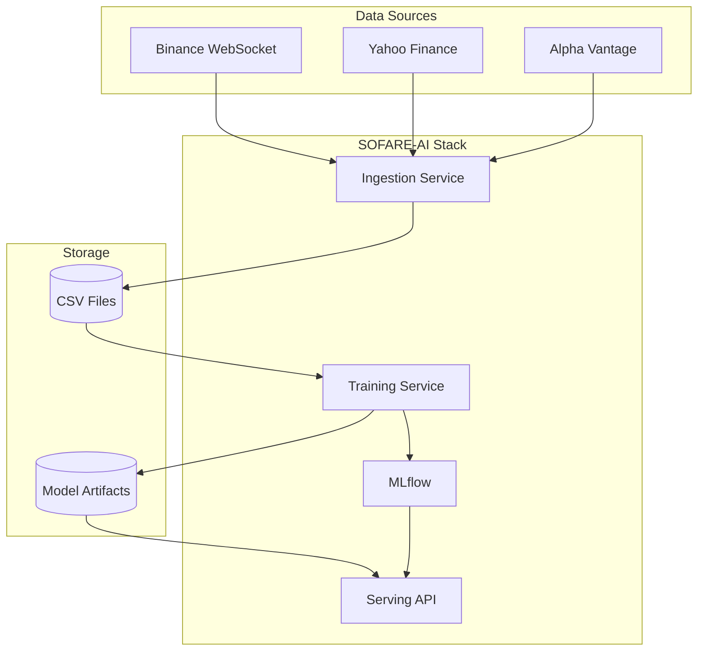

# Getting Started

Welcome to SOFARE-AI! This section will help you get up and running quickly.

## What is SOFARE-AI?

SOFARE-AI is a production-ready MLOps platform designed for cryptocurrency price prediction. It uses a multi-modal approach, combining:

- **Micro Data**: OHLCV (Open, High, Low, Close, Volume) with technical indicators
- **Macro Data**: Federal Funds Rate and economic indicators
- **Safe Haven Data**: Gold, DXY, S&P500, VIX, NASDAQ, Oil prices

## Prerequisites

Before you begin, ensure you have:

- [x] Docker and Docker Compose installed
- [x] Python 3.10+ (for local development)
- [x] Git
- [x] At least 8GB RAM recommended
- [x] 20GB free disk space

## Quick Links

-   :material-download:{ .lg .middle } **Installation**

    ---

    Step-by-step installation guide for all environments

    [:octicons-arrow-right-24: Install](installation.md)

-   :material-rocket-launch:{ .lg .middle } **Quick Start**

    ---

    Get your first prediction in under 5 minutes

    [:octicons-arrow-right-24: Quick Start](quickstart.md)

-   :material-cog:{ .lg .middle } **Configuration**

    ---

    Configure data sources, model parameters, and more

    [:octicons-arrow-right-24: Configure](configuration.md)

## Architecture Overview

## Next Steps

1. Follow the [Installation Guide](installation.md)
2. Complete the [Quick Start Tutorial](quickstart.md)
3. Explore the [Architecture](../architecture/index.md)
