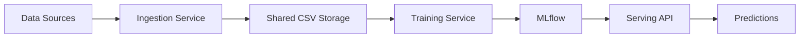

# SOFARE-AI

<div align="center">
  
  
  **Multi-modal ML Pipeline for Cryptocurrency Price Prediction**
  
  [](https://github.com/sofareai/sofareai/actions/workflows/ci-cd.yml)
  [](https://codecov.io/gh/sofareai/sofareai)
  [](https://sofareai.github.io/sofareai)
  [](LICENSE)
</div>

---

## Overview

SOFARE-AI is a production-ready MLOps platform for cryptocurrency price prediction using multi-modal data fusion. It combines:

- **OHLCV Data**: Real-time market data from Binance and Yahoo Finance
- **Macro Indicators**: Fed Funds Rate, economic indicators
- **Safe Haven Assets**: Gold, DXY, S&P500, VIX, NASDAQ, Oil

## Key Features

<div class="grid cards" markdown>

-   :material-robot:{ .lg .middle } **SofareM3 Model**

    ---

    Transformer + TCN encoders with attention fusion for multi-modal data processing

    [:octicons-arrow-right-24: Learn more](architecture/model.md)

-   :material-lightning-bolt:{ .lg .middle } **Real-time Ingestion**

    ---

    Multi-source data pipeline with fallback mechanisms and minute-level granularity

    [:octicons-arrow-right-24: Data Pipeline](architecture/data-pipeline.md)

-   :material-chart-line:{ .lg .middle } **MLflow Integration**

    ---

    Comprehensive experiment tracking, model versioning, and artifact management

    [:octicons-arrow-right-24: MLOps](architecture/mlops.md)

-   :material-docker:{ .lg .middle } **Docker Compose**

    ---

    Easy deployment with container orchestration and shared volumes

    [:octicons-arrow-right-24: Deployment](operations/deployment.md)

</div>

## Quick Start

```bash
# Clone the repository
git clone https://github.com/sofareai/sofareai.git
cd sofareai

# Start the stack
make up

# View logs
make logs
```

!!! tip "First time setup"
    See the [Installation Guide](getting-started/installation.md) for detailed setup instructions.

## Architecture



## Services

| Service | Port | Description |
|---------|------|-------------|
| Serving API | 8000 | FastAPI prediction endpoints |
| MLflow UI | 5000 | Experiment tracking dashboard |
| Ingestion | - | Background data collection |
| Training | - | Continuous model training |

## Documentation

- [Getting Started](getting-started/index.md) - Installation and quick start
- [Architecture](architecture/index.md) - System design and components
- [Operations](operations/index.md) - Deployment, monitoring, and maintenance
- [API Reference](api/index.md) - REST API documentation
- [Development](development/index.md) - Contributing guidelines

## License

This project is licensed under the MIT License - see the [LICENSE](https://github.com/sofareai/sofareai/blob/main/LICENSE) file for details.
