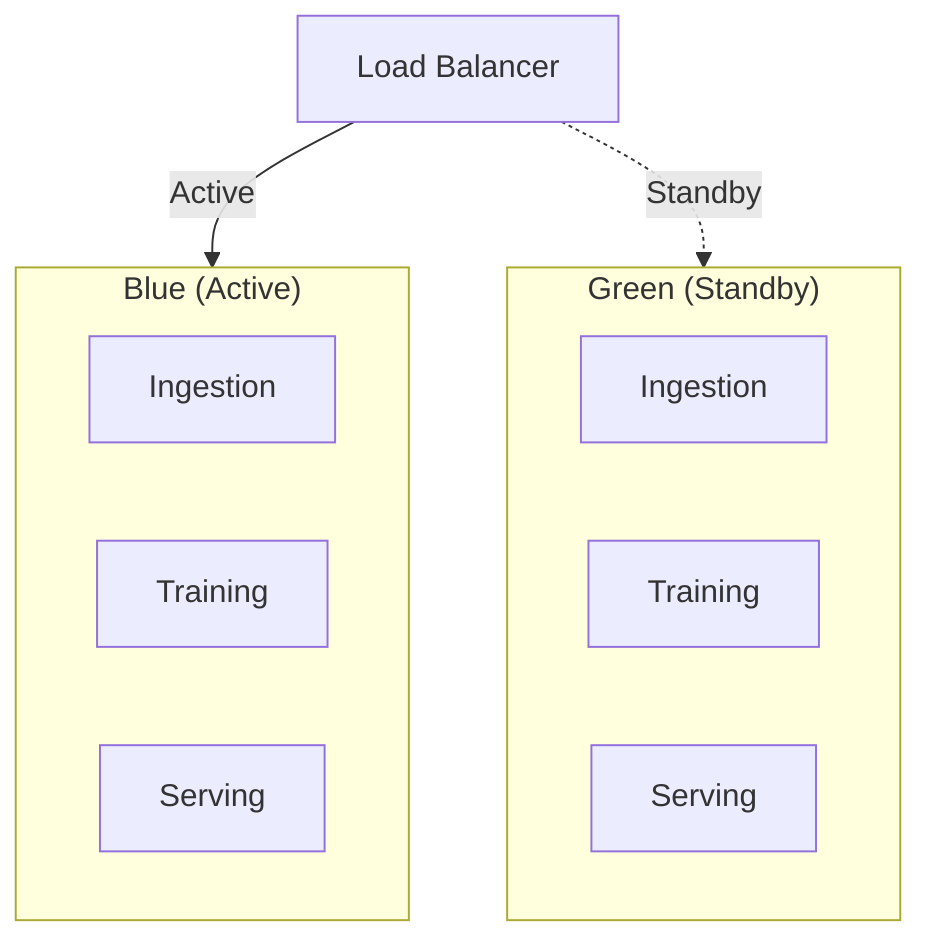
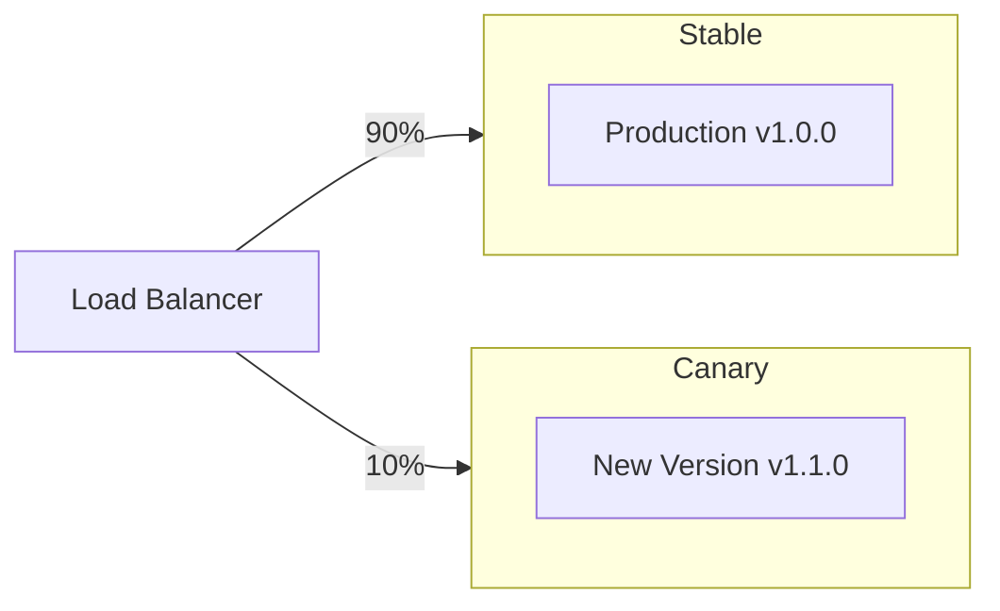

# Laporan Proyek MLOps SOFARE-AI

## ML Canvas SOFARE-AI

### 1. Background (Latar Belakang)
SOFARE-AI adalah sistem machine learning berbasis microservices untuk prediksi harga cryptocurrency. Sistem ini mengintegrasikan data multi-modal termasuk data OHLCV pasar crypto, indikator makroekonomi, dan performa aset safe-haven untuk melatih model deep learning canggih.

**Kontekst Bisnis:**
- Prediksi harga cryptocurrency merupakan tantangan kompleks karena volatilitas tinggi
- Data pasar crypto tersedia real-time namun sangat noise
- Faktor eksternal seperti kebijakan moneter dan sentimen pasar global sangat berpengaruh
- Kebutuhan akan sistem yang dapat beradaptasi dengan perubahan pasar yang cepat

**Masalah yang Dihadapi:**
- Data leakage dalam time-series modeling
- Drift data yang menyebabkan model menjadi outdated
- Kesulitan dalam deployment dan monitoring model ML di production
- Kurangnya sistem versioning dan rollback yang robust

### 2. Value Proposition (Proposisi Nilai)
SOFARE-AI memberikan nilai melalui:

**Untuk Data Scientist/ML Engineer:**
- Pipeline MLOps lengkap dengan automated training dan deployment
- Sistem drift detection otomatis untuk memastikan model tetap akurat
- Experiment tracking dengan MLflow untuk reproducibility
- Hyperparameter tuning otomatis dengan Optuna

**Untuk Business/Stakeholder:**
- Prediksi harga crypto yang akurat untuk decision making
- Sistem monitoring real-time untuk model performance
- Dashboard interaktif untuk visualisasi prediksi
- Reliability tinggi dengan automated rollback

**Untuk Developer:**
- Arsitektur microservices yang scalable
- API RESTful untuk easy integration
- Containerized deployment dengan Docker
- Dokumentasi lengkap dan best practices

### 3. Objective (Tujuan)
**Tujuan Utama:**
Membangun sistem ML yang dapat memprediksi harga cryptocurrency dengan akurasi >55% dan mampu beradaptasi otomatis terhadap perubahan kondisi pasar.

**Tujuan Spesifik:**
- Mengumpulkan dan memproses data multi-modal (OHLCV, macro, safe-haven)
- Melatih model deep learning yang robust terhadap market volatility
- Men-deploy model ke production dengan zero-downtime
- Memantau dan mendeteksi drift secara real-time
- Mengimplementasikan automated retraining dan rollback

**Success Metrics:**
- Model accuracy > 55% pada test set
- Latency prediction < 100ms
- Uptime system > 99.9%
- Mean Absolute Error (MAE) < 0.03 pada normalized price

### 4. Solution (Solusi)
SOFARE-AI mengimplementasikan solusi end-to-end MLOps dengan arsitektur microservices:

**Arsitektur Sistem:**
```
┌─────────────────┐    ┌─────────────────┐    ┌─────────────────┐
│   Ingestion     │    │    Training     │    │    Serving      │
│   Service       │◄──►│    Service      │◄──►│    Service      │
│                 │    │                 │    │                 │
│ • Binance WS    │    │ • SofareM3      │    │ • FastAPI        │
│ • Yahoo Finance │    │ • PyTorch       │    │ • Dashboard      │
│ • FRED API      │    │ • MLflow        │    │ • Real-time API  │
└─────────────────┘    └─────────────────┘    └─────────────────┘
       │                       │                       │
       └───────────────────────┼───────────────────────┘
                               │
                    ┌─────────────────┐
                    │   MLflow UI     │
                    │   (Port 5000)   │
                    └─────────────────┘
```

**Teknologi Stack:**
- **Data Processing:** Pandas, NumPy, TA-Lib
- **ML Framework:** PyTorch dengan custom architecture
- **MLOps Tools:** MLflow, Optuna, Docker
- **Serving:** FastAPI, Uvicorn
- **Orchestration:** Docker Compose, Kubernetes (opsional)
- **Monitoring:** Custom drift detection, health checks

### 5. Data (Data)
**Sumber Data Multi-Modal:**

**Micro Data (OHLCV + Technical Indicators):**
- **Source:** Binance WebSocket API (real-time), Yahoo Finance (historical)
- **Features:** Open, High, Low, Close, Volume, 19+ TA indicators
- **Granularity:** Minute-level (1440 records/day)
- **Update Frequency:** Real-time untuk live trading

**Macro Data (Economic Indicators):**
- **Source:** FRED API (Federal Reserve Economic Data)
- **Features:** Fed Funds Rate, GDP, Inflation, Employment data
- **Granularity:** Daily (di-expand ke minute-level)
- **Update Frequency:** Daily updates

**Safe Haven Data (Market Assets):**
- **Source:** Yahoo Finance API
- **Features:** Gold (XAU/USD), DXY, S&P500, VIX, NASDAQ, Oil (WTI)
- **Granularity:** Minute-level
- **Update Frequency:** Market hours (real-time)

**Data Pipeline:**
```python
# Data flow dari ingestion ke training
def data_pipeline():
    # 1. Collect real-time data
    micro_data = binance_client.get_ohlcv()
    macro_data = fred_client.get_macro_indicators()
    safe_data = yahoo_client.get_safe_haven_assets()
    
    # 2. Expand daily macro to minute-level
    macro_minute = expand_to_minute_granularity(macro_data)
    
    # 3. Merge all modalities
    merged_data = merge_multimodal_data(micro_data, macro_minute, safe_data)
    
    # 4. Add technical indicators
    features_data = add_technical_indicators(merged_data)
    
    # 5. Save to shared CSV
    features_data.to_csv("data/ohlcv.csv", index=False)
```

**Data Quality Assurance:**
- Null value detection dan removal
- Duplicate timestamp filtering
- Temporal ordering validation
- Statistical outlier detection

### 6. Metrics (Metrik)
**Model Performance Metrics:**

**Primary Metrics:**
- **Classification Accuracy:** >55% untuk up/down prediction
- **Mean Absolute Error (MAE):** <0.03 pada normalized returns
- **Root Mean Square Error (RMSE):** <0.05 pada price prediction

**Secondary Metrics:**
- **R² Score:** >0.8 untuk regression task
- **Precision/Recall/F1-Score:** Balanced untuk classification
- **AUC-ROC:** >0.7 untuk binary classification

**Business Metrics:**
- **Prediction Latency:** <100ms per request
- **System Uptime:** >99.9%
- **Data Freshness:** <5 minutes delay
- **Drift Detection:** <1 hour response time

**MLOps Metrics:**
- **Training Time:** <30 minutes per experiment
- **Model Size:** <500MB untuk deployment
- **Memory Usage:** <4GB RAM per serving instance
- **CPU Utilization:** <70% during peak load

### 7. Evaluation (Evaluasi)
**Evaluation Strategy:**

**Temporal Split (Kritis untuk Time-Series):**
```python
# Temporal train/val/test split - TIDAK PERNAH shuffle!
TRAIN_RATIO = 0.7   # 70% historical data
VAL_RATIO = 0.15    # 15% recent data untuk tuning
TEST_RATIO = 0.15   # 15% future data untuk final evaluation

# Split berdasarkan waktu
train_end = int(len(data) * TRAIN_RATIO)
val_end = int(len(data) * (TRAIN_RATIO + VAL_RATIO))

train_data = data[:train_end]
val_data = data[train_end:val_end]
test_data = data[val_end:]
```

**Cross-Validation untuk Time-Series:**
- Time-series split dengan expanding window
- Rolling window validation untuk robustness
- Out-of-sample testing pada data terbaru

**Evaluation Pipeline:**
```python
def evaluate_model(model, test_data):
    model.eval()
    with torch.no_grad():
        predictions = model(test_data)
        
        # Classification metrics
        cls_accuracy = accuracy_score(test_data['target'], predictions['cls'])
        cls_precision = precision_score(test_data['target'], predictions['cls'])
        cls_recall = recall_score(test_data['target'], predictions['cls'])
        
        # Regression metrics
        mae = mean_absolute_error(test_data['returns'], predictions['reg'])
        rmse = mean_squared_error(test_data['returns'], predictions['reg']) ** 0.5
        r2 = r2_score(test_data['returns'], predictions['reg'])
        
        return {
            'cls_accuracy': cls_accuracy,
            'cls_precision': cls_precision,
            'cls_recall': cls_recall,
            'mae': mae,
            'rmse': rmse,
            'r2_score': r2
        }
```

**Model Selection Criteria:**
- Accuracy > 55% pada test set
- MAE < 0.03 pada normalized returns
- Tidak overfit (val loss ≈ test loss)
- Computational efficiency untuk serving

### 8. Modeling (Pemodelan)
**SofareM3 Architecture:**

**Multi-Modal Encoder Design:**
```python
class SofareM3(nn.Module):
    def __init__(self):
        # Micro Encoder (OHLCV + TA)
        self.micro_encoder = TransformerEncoder(
            input_dim=len(micro_features),
            hidden_size=128,
            num_layers=2,
            num_heads=4
        )
        
        # Macro Encoder (Economic indicators)
        self.macro_encoder = TCNEncoder(
            input_dim=len(macro_features),
            hidden_size=64,
            num_layers=3
        )
        
        # Safe Haven Encoder (Market assets)
        self.safe_encoder = TransformerEncoder(
            input_dim=len(safe_features),
            hidden_size=64,
            num_layers=2,
            num_heads=2
        )
        
        # Attention Fusion Layer
        self.fusion_layer = MultiHeadAttention(
            embed_dim=256,
            num_heads=8
        )
        
        # Multi-task Head
        self.classification_head = nn.Linear(256, 2)  # Up/Down
        self.regression_head = nn.Linear(256, 1)      # Return prediction
```

**Training Strategy:**

**Loss Function (Multi-Task Learning):**
```python
def multi_task_loss(cls_pred, reg_pred, cls_target, reg_target):
    cls_loss = F.cross_entropy(cls_pred, cls_target)
    reg_loss = F.huber_loss(reg_pred.squeeze(), reg_target, delta=1.0)
    
    # Weighted combination
    total_loss = 0.5 * cls_loss + 0.5 * reg_loss
    return total_loss, cls_loss, reg_loss
```

**Optimization:**
- **Optimizer:** AdamW dengan weight decay
- **Scheduler:** Cosine annealing dengan warmup
- **Regularization:** Dropout, LayerNorm, Early stopping
- **Batch Size:** 32-64 samples
- **Sequence Length:** 30-90 minutes

**Hyperparameter Tuning dengan Optuna:**
```python
def objective(trial):
    # Search space
    hidden_size = trial.suggest_int("hidden_size", 64, 192)
    learning_rate = trial.suggest_float("learning_rate", 1e-4, 1e-2, log=True)
    dropout = trial.suggest_float("dropout", 0.1, 0.4)
    num_layers = trial.suggest_int("num_encoder_layers", 1, 3)
    
    # Train model
    model = SofareM3(hidden_size=hidden_size, dropout=dropout, num_layers=num_layers)
    # ... training code ...
    
    return val_accuracy
```

### 9. Inference (Inferensi)
**Serving Architecture:**

**FastAPI Serving Service:**
```python
@app.post("/predict")
async def predict(request: PredictionRequest):
    # Load latest model
    model = load_model_from_registry()
    
    # Preprocess input data
    processed_data = preprocess_input(request.data)
    
    # Make prediction
    with torch.no_grad():
        prediction = model(processed_data)
    
    # Post-process results
    result = {
        "timestamp": request.timestamp,
        "prediction": {
            "direction": "up" if prediction['cls'] > 0.5 else "down",
            "confidence": float(prediction['cls']),
            "expected_return": float(prediction['reg'])
        },
        "model_version": get_current_model_version(),
        "latency_ms": time.time() - start_time
    }
    
    return result
```

**Real-time Inference Pipeline:**
1. **Data Ingestion:** Continuous data collection via WebSocket
2. **Feature Engineering:** Real-time TA calculation
3. **Model Inference:** Batch prediction dengan sliding window
4. **Result Caching:** Redis untuk frequently requested predictions
5. **API Response:** JSON dengan millisecond timestamps untuk ApexCharts

**Scalability Considerations:**
- **Horizontal Scaling:** Multiple serving instances behind load balancer
- **Model Optimization:** ONNX export untuk faster inference
- **Caching Strategy:** Prediction caching untuk repeated queries
- **Async Processing:** Non-blocking I/O untuk high throughput

## Operasi MLOps Detail

### Data Training Strategy

**Full Dataset vs Rolling Window:**
```python
# BEST PRACTICE: Full Dataset Training
USE_FULL_DATASET = True
TRAIN_RATIO = 0.7
VAL_RATIO = 0.15
TEST_RATIO = 0.15

# Temporal split - NO SHUFFLING!
train_data = data[:train_end]
val_data = data[train_end:val_end]
test_data = data[val_end:]
```

**Keuntungan Full Dataset:**
- ✅ Belajar dari semua pola historis termasuk black swan events
- ✅ Robust terhadap berbagai kondisi pasar
- ✅ Proper temporal validation
- ✅ Held-out test set untuk evaluasi objektif

### Deployment Strategies

**Blue-Green Deployment:**


**Canary Deployment:**


### Drift Detection

**Statistical Tests Implementation:**
```python
from training.src.drift_detector import DriftDetector

detector = DriftDetector(
    ks_threshold=0.05,
    psi_threshold=0.2,
    wasserstein_threshold=0.1
)

# Detect multivariate drift
result = detector.detect_multivariate_drift(current_data)
if result.drift_detected:
    if result.severity == DriftSeverity.CRITICAL:
        trigger_retraining(priority="high")
    elif result.severity == DriftSeverity.HIGH:
        schedule_retraining(delay_hours=24)
```

**Drift Types:**
- **Input Drift:** Perubahan distribusi feature
- **Prediction Drift:** Perubahan distribusi output
- **Concept Drift:** Perubahan relationship input-output
- **Performance Degradation:** Penurunan akurasi metrics

### Hyperparameter Tuning

**Optuna Integration:**
```python
import optuna

def objective(trial):
    # Architecture parameters
    hidden_size = trial.suggest_int("hidden_size", 64, 192)
    embed_dim = trial.suggest_categorical("embed_dim", [64, 128])
    num_heads = trial.suggest_int("num_heads", 4, 8)
    
    # Training parameters
    learning_rate = trial.suggest_float("learning_rate", 1e-4, 1e-2, log=True)
    batch_size = trial.suggest_categorical("batch_size", [32, 64])
    dropout = trial.suggest_float("dropout", 0.1, 0.4)
    
    # Train and evaluate
    model = SofareM3(hidden_size=hidden_size, embed_dim=embed_dim, ...)
    accuracy = train_and_evaluate(model, train_data, val_data)
    
    return accuracy

study = optuna.create_study(direction="maximize")
study.optimize(objective, n_trials=50)
```

### Rollback Strategies

**Automatic Rollback Triggers:**
```python
def check_and_rollback():
    # Check critical drift
    drift_result = detector.detect_multivariate_drift(current_data)
    if drift_result.severity == DriftSeverity.CRITICAL:
        manager.rollback()
        notify_team("Model rolled back due to critical drift")
        return True
    
    # Check performance degradation
    perf_result = detector.detect_performance_degradation(
        baseline_metrics, current_metrics, degradation_threshold=0.1
    )
    if perf_result.drift_detected:
        manager.rollback()
        notify_team("Model rolled back due to performance degradation")
        return True
    
    return False
```

**Rollback Procedures:**
1. **Emergency Rollback:** Immediate traffic switch untuk critical issues
2. **Planned Rollback:** Gradual traffic shift dengan monitoring
3. **Canary Rollback:** Reverse canary deployment
4. **Version Rollback:** Revert ke previous model version

### Semantic Versioning

**Version Format:** `MAJOR.MINOR.PATCH[-PRERELEASE][+BUILD]`

**Automatic Version Bump Rules:**
```python
def determine_version_bump(current_metrics, new_metrics, architecture_changed, features_changed):
    if architecture_changed or features_changed:
        return VersionBump.MAJOR
    elif new_metrics['accuracy'] > current_metrics['accuracy'] + 0.05:  # >5% improvement
        return VersionBump.MINOR
    else:
        return VersionBump.PATCH
```

**Version Lifecycle:**
- `DRAFT` → `CANDIDATE` → `RELEASED` → `DEPRECATED`/`ROLLED_BACK`

## Kesimpulan

SOFARE-AI merupakan implementasi lengkap MLOps untuk prediksi harga cryptocurrency dengan fokus pada:

1. **Data Quality:** Multi-modal data integration dengan proper temporal handling
2. **Model Robustness:** Full dataset training dengan temporal validation
3. **Production Reliability:** Comprehensive deployment dan monitoring strategies
4. **Automated Adaptation:** Drift detection dan automated retraining
5. **Operational Excellence:** Version management dan rollback capabilities

Sistem ini menunjukkan best practices MLOps modern dengan integrasi tools seperti MLflow, Optuna, dan Docker untuk mencapai reliability dan scalability tinggi dalam production environment.