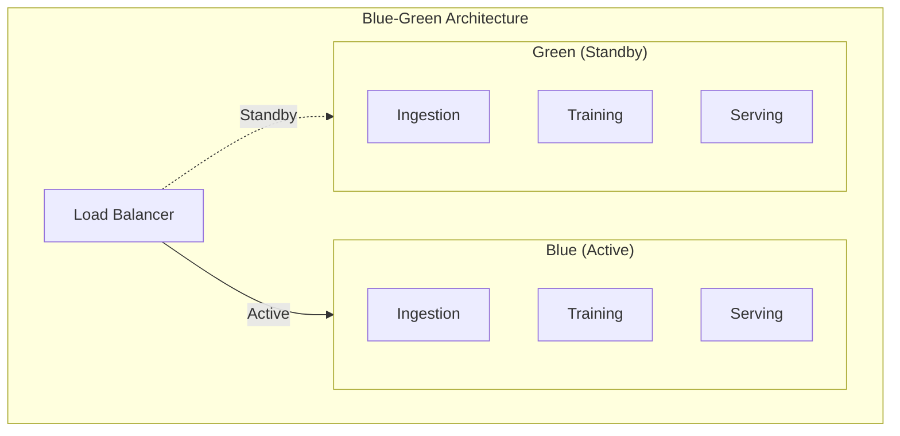
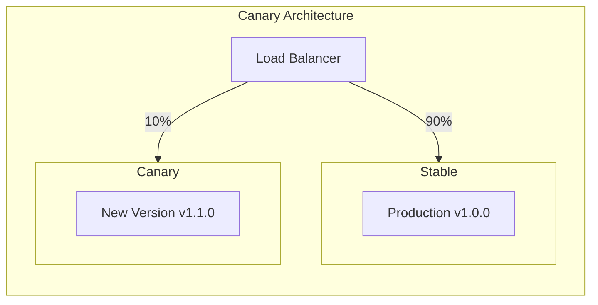

# Deployment

Comprehensive guide to deploying SOFARE-AI in various environments.

## Deployment Strategies

SOFARE-AI supports multiple deployment strategies to minimize risk and ensure high availability.

### Blue-Green Deployment

Used for **staging** deployments with zero-downtime updates.



**How it works:**

1. Deploy new version to inactive environment (Green)
2. Run smoke tests on Green
3. Switch load balancer to Green
4. Blue becomes standby for next deployment

### Canary Deployment

Used for **production** deployments with gradual traffic shifting.



**Traffic progression:**

| Phase | Stable | Canary | Duration | Check |
|-------|--------|--------|----------|-------|
| Initial | 90% | 10% | 5 min | Error rate < 1% |
| Validation | 50% | 50% | 30 min | Latency normal |
| Promotion | 0% | 100% | - | All metrics pass |

## Environment Setup

### Development

```bash
# Local development with hot-reload
make up

# View logs
make logs
```

### Staging

```bash
# Deploy to staging
docker compose -f docker-compose.yml -f docker-compose.staging.yml up -d

# Run smoke tests
./scripts/smoke-tests.sh staging
```

### Production

```bash
# Deploy with canary strategy
./scripts/deploy-production.sh v1.0.0

# Monitor canary
./scripts/monitor-canary.sh
```

## Kubernetes Deployment

### Prerequisites

- Kubernetes cluster (1.24+)
- kubectl configured
- Helm 3.x
- Container registry access

### Helm Chart

```bash
# Add SOFARE-AI Helm repository
helm repo add sofareai https://charts.sofareai.io

# Install
helm install sofareai sofareai/sofareai \
  --namespace sofareai \
  --create-namespace \
  --values values.yaml
```

### Custom Values

```yaml title="values.yaml"
# Image configuration
image:
  registry: ghcr.io
  repository: sofareai/sofareai
  tag: v1.0.0
  pullPolicy: IfNotPresent

# Serving service
serving:
  replicas: 3
  resources:
    requests:
      cpu: 500m
      memory: 1Gi
    limits:
      cpu: 2
      memory: 4Gi
  
  autoscaling:
    enabled: true
    minReplicas: 2
    maxReplicas: 10
    targetCPUUtilization: 70

# Training service
training:
  enabled: true
  resources:
    requests:
      cpu: 2
      memory: 8Gi
    limits:
      cpu: 4
      memory: 16Gi
  
  # GPU support
  gpu:
    enabled: false
    count: 1

# Ingestion service
ingestion:
  enabled: true
  resources:
    requests:
      cpu: 250m
      memory: 512Mi

# MLflow
mlflow:
  enabled: true
  persistence:
    size: 50Gi
    storageClass: standard

# Monitoring
monitoring:
  prometheus:
    enabled: true
  grafana:
    enabled: true
```

### Kubernetes Manifests

```yaml title="k8s/serving-deployment.yaml"
apiVersion: apps/v1
kind: Deployment
metadata:
  name: sofareai-serving
  labels:
    app: sofareai
    component: serving
spec:
  replicas: 3
  selector:
    matchLabels:
      app: sofareai
      component: serving
  template:
    metadata:
      labels:
        app: sofareai
        component: serving
    spec:
      containers:
        - name: serving
          image: ghcr.io/sofareai/serving:v1.0.0
          ports:
            - containerPort: 8000
          env:
            - name: MLFLOW_TRACKING_URI
              value: "http://mlflow:5000"
          resources:
            requests:
              memory: "1Gi"
              cpu: "500m"
            limits:
              memory: "4Gi"
              cpu: "2"
          livenessProbe:
            httpGet:
              path: /health
              port: 8000
            initialDelaySeconds: 30
            periodSeconds: 10
          readinessProbe:
            httpGet:
              path: /health
              port: 8000
            initialDelaySeconds: 5
            periodSeconds: 5
          volumeMounts:
            - name: data
              mountPath: /app/data
            - name: shared-model
              mountPath: /app/shared_model
      volumes:
        - name: data
          persistentVolumeClaim:
            claimName: sofareai-data
        - name: shared-model
          persistentVolumeClaim:
            claimName: sofareai-model
---
apiVersion: v1
kind: Service
metadata:
  name: sofareai-serving
spec:
  selector:
    app: sofareai
    component: serving
  ports:
    - port: 8000
      targetPort: 8000
  type: ClusterIP
```

### Istio Virtual Service (Canary)

```yaml title="k8s/virtual-service.yaml"
apiVersion: networking.istio.io/v1beta1
kind: VirtualService
metadata:
  name: sofareai
spec:
  hosts:
    - sofareai.example.com
  gateways:
    - sofareai-gateway
  http:
    - match:
        - uri:
            prefix: /
      route:
        - destination:
            host: sofareai-serving-stable
            port:
              number: 8000
          weight: 90
        - destination:
            host: sofareai-serving-canary
            port:
              number: 8000
          weight: 10
```

## CI/CD Pipeline

The GitHub Actions pipeline handles automated deployments:

```yaml title=".github/workflows/ci-cd.yml"
deploy-production:
  name: Deploy to Production (Canary)
  runs-on: ubuntu-latest
  needs: build
  if: startsWith(github.ref, 'refs/tags/v')
  
  steps:
    - name: Deploy Canary (10%)
      run: |
        kubectl set image deployment/sofareai-canary \
          serving=ghcr.io/sofareai/serving:${{ github.ref_name }}
        
        kubectl patch virtualservice sofareai \
          --type merge \
          -p '{"spec":{"http":[{"route":[
            {"destination":{"host":"stable"},"weight":90},
            {"destination":{"host":"canary"},"weight":10}
          ]}]}}'
    
    - name: Monitor Canary
      run: |
        # Wait and check metrics
        sleep 300
        
        ERROR_RATE=$(curl -s prometheus/api/v1/query?query=...)
        
        if [ "$ERROR_RATE" -gt "0.01" ]; then
          echo "Error rate too high, rolling back"
          exit 1
        fi
    
    - name: Promote to 100%
      run: |
        kubectl patch virtualservice sofareai \
          --type merge \
          -p '{"spec":{"http":[{"route":[
            {"destination":{"host":"canary"},"weight":100}
          ]}]}}'
```

## Scaling

### Horizontal Pod Autoscaler

```yaml title="k8s/hpa.yaml"
apiVersion: autoscaling/v2
kind: HorizontalPodAutoscaler
metadata:
  name: sofareai-serving
spec:
  scaleTargetRef:
    apiVersion: apps/v1
    kind: Deployment
    name: sofareai-serving
  minReplicas: 2
  maxReplicas: 20
  metrics:
    - type: Resource
      resource:
        name: cpu
        target:
          type: Utilization
          averageUtilization: 70
    - type: Resource
      resource:
        name: memory
        target:
          type: Utilization
          averageUtilization: 80
    - type: Pods
      pods:
        metric:
          name: http_requests_per_second
        target:
          type: AverageValue
          averageValue: 1000
```

### Vertical Pod Autoscaler

```yaml title="k8s/vpa.yaml"
apiVersion: autoscaling.k8s.io/v1
kind: VerticalPodAutoscaler
metadata:
  name: sofareai-training
spec:
  targetRef:
    apiVersion: apps/v1
    kind: Deployment
    name: sofareai-training
  updatePolicy:
    updateMode: Auto
  resourcePolicy:
    containerPolicies:
      - containerName: training
        minAllowed:
          cpu: 1
          memory: 4Gi
        maxAllowed:
          cpu: 8
          memory: 32Gi
```

## Health Checks

### Liveness Probe

Checks if the container is running:

```yaml
livenessProbe:
  httpGet:
    path: /health
    port: 8000
  initialDelaySeconds: 30
  periodSeconds: 10
  failureThreshold: 3
```

### Readiness Probe

Checks if the container is ready to receive traffic:

```yaml
readinessProbe:
  httpGet:
    path: /health
    port: 8000
  initialDelaySeconds: 5
  periodSeconds: 5
  failureThreshold: 3
```

### Startup Probe

For slow-starting containers (e.g., model loading):

```yaml
startupProbe:
  httpGet:
    path: /health
    port: 8000
  initialDelaySeconds: 10
  periodSeconds: 10
  failureThreshold: 30  # 5 minutes max
```

## Security Considerations

### Network Policies

```yaml title="k8s/network-policy.yaml"
apiVersion: networking.k8s.io/v1
kind: NetworkPolicy
metadata:
  name: sofareai-serving
spec:
  podSelector:
    matchLabels:
      app: sofareai
      component: serving
  policyTypes:
    - Ingress
    - Egress
  ingress:
    - from:
        - podSelector:
            matchLabels:
              app: ingress-nginx
      ports:
        - port: 8000
  egress:
    - to:
        - podSelector:
            matchLabels:
              app: sofareai
              component: mlflow
      ports:
        - port: 5000
```

### Secrets Management

```yaml title="k8s/sealed-secret.yaml"
apiVersion: bitnami.com/v1alpha1
kind: SealedSecret
metadata:
  name: sofareai-secrets
spec:
  encryptedData:
    BINANCE_API_KEY: AgBy8hQ...
    ALPHA_VANTAGE_API_KEY: AgBy8hQ...
```

## Disaster Recovery

### Backup Strategy

- **MLflow data**: Daily backups to S3
- **Model artifacts**: Versioned in artifact store
- **Configuration**: Stored in Git

### Recovery Procedure

1. Restore MLflow from backup
2. Deploy last known good version
3. Verify data pipeline connectivity
4. Resume normal operations

## Next Steps

- [Monitoring Guide](monitoring.md)
- [Rollback Strategies](rollback.md)
- [A/B Testing](ab-testing.md)
