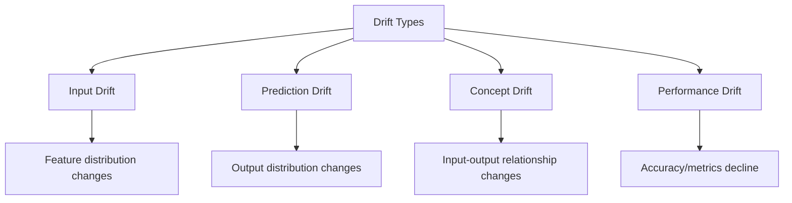

# Drift Detection

Comprehensive guide to detecting and handling data and model drift in SOFARE-AI.

## Overview

Drift detection is crucial for maintaining model performance in production. SOFARE-AI implements multiple drift detection strategies:

- **Input/Feature Drift**: Changes in input data distributions
- **Prediction Drift**: Changes in model output distributions
- **Concept Drift**: Changes in the relationship between inputs and outputs
- **Performance Degradation**: Decline in model accuracy metrics

## Types of Drift



## Statistical Tests

SOFARE-AI uses multiple statistical tests:

### Kolmogorov-Smirnov Test

Best for: Detecting distribution shape changes

```python
from training.src.drift_detector import DriftDetector

detector = DriftDetector(ks_threshold=0.05)
detector.set_reference_data(training_data)

results = detector.detect_univariate_drift(
    current_data,
    features=["close", "volume", "rsi"],
    test_type="ks"
)

for result in results:
    print(f"{result.feature_name}: drift={result.drift_detected}, p={result.p_value:.4f}")
```

### Population Stability Index (PSI)

Best for: Industry-standard drift measurement

| PSI Value | Interpretation |
|-----------|----------------|
| < 0.1 | No significant change |
| 0.1 - 0.2 | Moderate change |
| ≥ 0.2 | Significant change |

```python
results = detector.detect_univariate_drift(
    current_data,
    test_type="psi"
)
```

### Wasserstein Distance

Best for: Measuring distribution distance

```python
results = detector.detect_univariate_drift(
    current_data,
    test_type="wasserstein"
)
```

### Jensen-Shannon Divergence

Best for: Symmetric divergence measurement

```python
results = detector.detect_univariate_drift(
    current_data,
    test_type="jsd"
)
```

## Implementation

### Basic Usage

```python
from training.src.drift_detector import DriftDetector, DriftSeverity
import pandas as pd

# Initialize detector
detector = DriftDetector(
    ks_threshold=0.05,
    psi_threshold=0.2,
    wasserstein_threshold=0.1
)

# Load reference data (from training)
reference_df = pd.read_csv("data/training_reference.csv")
detector.set_reference_data(reference_df)

# Load current data
current_df = pd.read_csv("data/ohlcv.csv").tail(1000)

# Run multivariate drift detection
result = detector.detect_multivariate_drift(current_df)

print(f"Drift detected: {result.drift_detected}")
print(f"Severity: {result.severity.value}")
print(f"Drifted features: {result.details['drifted_features']}")
```

### Performance Degradation Detection

```python
# Compare model metrics
reference_metrics = {
    "accuracy": 0.65,
    "precision": 0.62,
    "recall": 0.68,
    "f1_score": 0.65
}

current_metrics = {
    "accuracy": 0.58,
    "precision": 0.55,
    "recall": 0.61,
    "f1_score": 0.58
}

result = detector.detect_performance_degradation(
    reference_metrics,
    current_metrics,
    degradation_threshold=0.1  # 10% degradation
)

if result.drift_detected:
    print(f"⚠️ Performance degradation detected!")
    print(f"Max degradation: {result.details['max_degradation']:.1%}")
```

### Prediction Drift

```python
import numpy as np

# Reference predictions (from validation)
reference_preds = np.array([...])

# Current predictions
current_preds = np.array([...])

result = detector.detect_prediction_drift(
    reference_preds,
    current_preds
)
```

## Automated Monitoring

### Scheduled Detection

The CI/CD pipeline runs drift detection daily:

```yaml title=".github/workflows/ci-cd.yml"
drift-detection:
  name: Drift Detection
  runs-on: ubuntu-latest
  if: github.event_name == 'schedule'
  
  steps:
    - uses: actions/checkout@v4
    
    - name: Run drift detection
      run: python -m training.src.drift_detector --check-all
    
    - name: Create alert if drift detected
      if: failure()
      uses: actions/github-script@v7
      with:
        script: |
          github.rest.issues.create({
            owner: context.repo.owner,
            repo: context.repo.repo,
            title: '⚠️ Data Drift Detected',
            labels: ['drift', 'automated']
          })
```

### Real-time Monitoring

Integrate with the serving API:

```python title="serving/src/app.py"
from training.src.drift_detector import DriftDetector

# Initialize detector
detector = DriftDetector()

@app.post("/predict")
async def predict():
    # ... prediction logic ...
    
    # Check for drift in real-time
    if detector.reference_data is not None:
        current_window = get_recent_data(window=100)
        result = detector.detect_univariate_drift(
            current_window,
            features=["close", "volume"],
            test_type="psi"
        )
        
        if any(r.drift_detected for r in result):
            # Log warning
            logger.warning("Real-time drift detected")
            drift_detected = True
    
    return {
        "prediction": prediction,
        "drift_detected": drift_detected
    }
```

## Drift Response Strategies

### Automatic Retraining

```python
def handle_drift(drift_result):
    """Handle detected drift."""
    if drift_result.severity == DriftSeverity.CRITICAL:
        # Immediate retraining
        trigger_retraining(priority="high")
        notify_team(f"Critical drift in {drift_result.feature_name}")
    
    elif drift_result.severity == DriftSeverity.HIGH:
        # Schedule retraining
        schedule_retraining(delay_hours=24)
        notify_team(f"High drift detected, retraining scheduled")
    
    elif drift_result.severity in [DriftSeverity.MEDIUM, DriftSeverity.LOW]:
        # Monitor closely
        increase_monitoring_frequency()
        log_drift_event(drift_result)
```

### Feature-Specific Actions

| Feature Type | Drift Action |
|--------------|--------------|
| Price features | Check data source, verify normalization |
| Volume features | May need scaler update |
| TA indicators | Recalculate from raw data |
| Macro features | Check API availability |

## Drift Report

Generate comprehensive reports:

```python
report = detector.get_drift_report()

print(f"Status: {report['status']}")
print(f"\nSummary:")
print(f"  Total checks: {report['summary']['total_checks']}")
print(f"  Drift detected: {report['summary']['drift_detected']}")
print(f"  Critical: {report['summary']['critical']}")
print(f"  High: {report['summary']['high']}")

print(f"\nRecommendations:")
for rec in report['recommendations']:
    print(f"  {rec}")
```

Example output:

```
Status: WARNING

Summary:
  Total checks: 19
  Drift detected: 3
  Critical: 0
  High: 2

Recommendations:
  ⚠️ WARNING: 2 feature(s) show high drift. Schedule retraining within 24-48 hours.
  📉 Model performance degradation detected. Consider A/B testing with a retrained model.
```

## Best Practices

!!! tip "Reference Data Management"
    
    - Store reference data with each model version
    - Update reference data after successful retraining
    - Use representative samples (not just recent data)

!!! tip "Threshold Tuning"
    
    - Start with conservative thresholds
    - Adjust based on false positive/negative rates
    - Different thresholds for different features

!!! warning "Common Pitfalls"
    
    - Don't rely on a single test
    - Consider seasonal patterns
    - Account for natural market volatility
    - Test on multiple time windows

## Integration with MLflow

Log drift metrics to MLflow:

```python
import mlflow

with mlflow.start_run():
    # Run drift detection
    results = detector.detect_univariate_drift(current_data)
    
    # Log metrics
    for result in results:
        mlflow.log_metric(
            f"drift_pvalue_{result.feature_name}",
            result.p_value
        )
        mlflow.log_metric(
            f"drift_statistic_{result.feature_name}",
            result.statistic
        )
    
    # Log report as artifact
    report = detector.get_drift_report()
    with open("drift_report.json", "w") as f:
        json.dump(report, f)
    mlflow.log_artifact("drift_report.json")
```

## Next Steps

- [A/B Testing Guide](ab-testing.md)
- [Rollback Strategies](rollback.md)
- [Monitoring Setup](monitoring.md)
