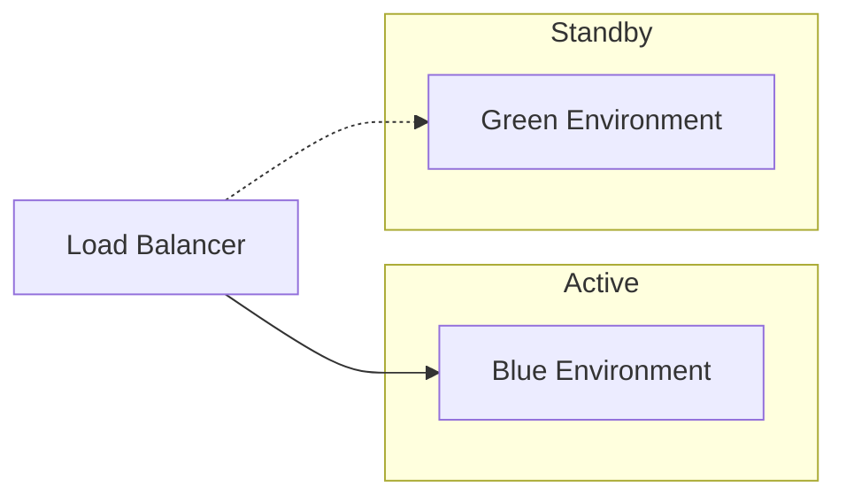
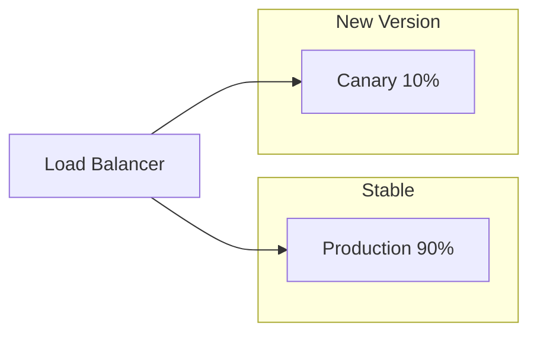

# Operations

This section covers operational aspects of running SOFARE-AI in production.

## Overview

Operating SOFARE-AI involves:

- **Deployment**: Getting the system running in various environments
- **Monitoring**: Tracking system health and model performance
- **Drift Detection**: Identifying when models need retraining
- **Semantic Versioning**: Managing model versions with automated versioning
- **Rollback**: Recovering from problematic deployments

## Quick Links

-   :material-rocket-launch:{ .lg .middle } **Deployment**

    ---

    Deploy to development, staging, and production environments

    [:octicons-arrow-right-24: Deployment Guide](deployment.md)

-   :material-chart-box:{ .lg .middle } **Monitoring**

    ---

    Set up comprehensive monitoring and alerting

    [:octicons-arrow-right-24: Monitoring](monitoring.md)

-   :material-alert:{ .lg .middle } **Drift Detection**

    ---

    Detect when your model needs retraining

    [:octicons-arrow-right-24: Drift Detection](drift-detection.md)

-   :material-tag:{ .lg .middle } **Semantic Versioning**

    ---

    Automatic model versioning with MAJOR.MINOR.PATCH

    [:octicons-arrow-right-24: Versioning](versioning.md)

-   :material-backup-restore:{ .lg .middle } **Rollback**

    ---

    Recover from problematic deployments

    [:octicons-arrow-right-24: Rollback Strategies](rollback.md)

## Deployment Strategies

SOFARE-AI supports multiple deployment strategies:

### Blue-Green Deployment

- Zero-downtime deployments
- Easy rollback by switching environments
- Used for staging deployments

### Canary Deployment

- Gradual traffic shifting (10% → 50% → 100%)
- Automatic rollback on errors
- Used for production deployments

## Monitoring Dashboard

Key metrics to track:

| Metric | Description | Alert Threshold |
|--------|-------------|-----------------|
| Prediction Latency | API response time | > 500ms |
| Error Rate | Failed predictions | > 1% |
| Model Accuracy | Classification accuracy | < 55% |
| Data Freshness | Age of latest data | > 5 minutes |
| Drift Score | Feature drift level | > 0.2 PSI |

## Operational Runbook

### Daily Tasks

- [ ] Check MLflow dashboard for training runs
- [ ] Review drift detection alerts
- [ ] Monitor API error rates
- [ ] Verify data ingestion is running

### Weekly Tasks

- [ ] Review model performance metrics
- [ ] Check version history and releases
- [ ] Update documentation if needed
- [ ] Backup MLflow data

### Monthly Tasks

- [ ] Review and archive old model versions
- [ ] Evaluate retraining strategies
- [ ] Security updates and patches
- [ ] Capacity planning review

## Emergency Procedures

!!! danger "Production Incident"
    
    If you experience issues in production:
    
    1. **Check logs**: `docker compose logs -f serving`
    2. **Verify health**: `curl http://localhost:8000/health`
    3. **Rollback if needed**: Follow [Rollback Guide](rollback.md)
    4. **Create incident report** after resolution
