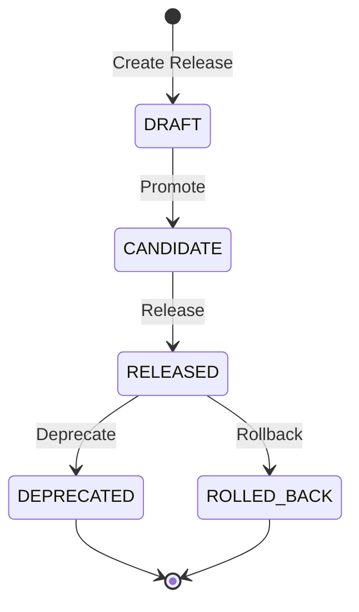

# Semantic Versioning

Panduan lengkap sistem semantic versioning untuk model ML di SOFARE-AI.

## Overview

SOFARE-AI menggunakan **Semantic Versioning (SemVer)** untuk mengelola versi model dengan format:

```
MAJOR.MINOR.PATCH[-PRERELEASE][+BUILD]
```

| Component | Kapan Increment | Contoh |
|-----------|-----------------|--------|
| **MAJOR** | Perubahan arsitektur, breaking changes | `2.0.0` |
| **MINOR** | Fitur baru, peningkatan signifikan (>5% accuracy) | `1.1.0` |
| **PATCH** | Bug fix, improvement kecil | `1.0.1` |
| **PRERELEASE** | Release candidate, alpha, beta | `1.0.0-rc.1` |
| **BUILD** | Build metadata | `1.0.0+build.123` |

## Release Lifecycle



### Status Definitions

| Status | Description |
|--------|-------------|
| `DRAFT` | Release dalam pengembangan, belum siap untuk testing |
| `CANDIDATE` | Siap untuk testing dan validasi |
| `RELEASED` | Terverifikasi dan siap untuk production |
| `DEPRECATED` | Tidak direkomendasikan, akan dihapus |
| `ROLLED_BACK` | Ditarik kembali karena issue |

## Automatic Version Management

SOFARE-AI secara otomatis menentukan version bump berdasarkan:

### 1. Metric Improvement

```python
# Dalam train.py
from version_manager import determine_version_bump, VersionBump

bump_type = determine_version_bump(
    current_metrics=previous_metrics,
    new_metrics=current_metrics,
    architecture_changed=False,
    features_changed=False
)

# Rules:
# - Accuracy improvement > 5% → MINOR
# - Architecture changed → MAJOR
# - Features changed → MAJOR
# - Otherwise → PATCH
```

### 2. Auto-Promotion Criteria

Model akan otomatis di-promote ke production jika:

```python
# Threshold untuk auto-promotion
if accuracy > 0.55:  # 55% classification accuracy
    version_manager.release_version(str(release.version))
    version_manager.deploy_to_production(str(release.version))
    version_manager.set_champion(str(release.version))
```

## Integration dengan Docker

### Environment Variables

```yaml
# docker-compose.yml
training:
  environment:
    - MODEL_REGISTRY_PATH=/app/shared_model/registry
    - MLFLOW_TRACKING_URI=http://mlflow:5000
```

### Shared Volume

Version registry disimpan di shared volume:

```
/app/shared_model/
├── registry/
│   └── releases.json      # Version registry
├── model_weights.pth      # Current model weights
├── model_config.json      # Model configuration + version
└── scalers.pkl            # Preprocessing scalers
```

## Usage Examples

### Check Current Version

```python
from version_manager import ModelVersionManager

manager = ModelVersionManager(
    model_name="sofarem3",
    registry_path="/app/shared_model/registry"
)

# Get latest version
latest = manager.get_latest_version()
print(f"Latest version: {latest}")  # Output: 1.2.3

# Get production version
prod = manager.get_production_version()
print(f"Production: {prod.version}")
```

### View Release History

```python
# Get last 10 releases
history = manager.get_release_history(limit=10)
for release in history:
    print(f"{release.version} - {release.status.value} - Acc: {release.metrics.get('cls_accuracy', 'N/A')}")
```

### Compare Versions

```python
comparison = manager.compare_versions("1.1.0", "1.2.0")
print(f"Metric changes: {comparison['metric_comparison']}")
print(f"Breaking changes: {comparison['breaking_changes']}")
```

### Generate Changelog

```python
changelog = manager.generate_changelog(
    from_version="1.0.0",
    to_version="1.2.0"
)
print(changelog)
```

## MLflow Integration

Setiap release secara otomatis di-log ke MLflow:

### Tags

```python
mlflow.set_tag("model_version", str(release.version))
mlflow.set_tag("release_status", release.status.value)
```

### Metrics

Semua metrics disimpan dalam release:

```python
release.metrics = {
    "mae": 0.0234,
    "rmse": 0.0456,
    "r2_score": 0.87,
    "cls_accuracy": 0.72,
    "val_cls_loss": 0.45,
    "val_reg_loss": 0.023
}
```

## Best Practices

### 1. Version Naming Convention

```
sofarem3-1.2.3          # Standard release
sofarem3-1.3.0-rc.1     # Release candidate
sofarem3-2.0.0-alpha.1  # Major version alpha
```

### 2. Changelog Format

```markdown
## [1.2.0] - 2024-01-15

### Added
- New safe haven features (NASDAQ, Oil)
- Improved drift detection

### Changed
- Updated attention mechanism

### Metrics
- cls_accuracy: 0.72 (+5%)
- mae: 0.023 (-10%)
```

### 3. Breaking Changes Documentation

```python
release = manager.create_release(
    mlflow_run_id=run_id,
    bump_type=VersionBump.MAJOR,
    breaking_changes=[
        "Changed input feature order",
        "Removed deprecated macro features",
        "New model architecture requires retrained scalers"
    ]
)
```

## Monitoring

### Version Metrics in Logs

```
INFO:training:Created model release: sofarem3-1.2.0 (v1.2.0)
INFO:training:Determined version bump: minor
INFO:training:Model v1.2.0 deployed to production as champion
```

### Registry File Structure

```json
{
  "model_name": "sofarem3",
  "releases": {
    "1.2.0": {
      "version": "1.2.0",
      "model_id": "sofarem3-1.2.0",
      "mlflow_run_id": "abc123...",
      "status": "released",
      "is_production": true,
      "is_champion": true,
      "metrics": {...},
      "created_at": "2024-01-15T10:30:00Z"
    }
  }
}
```

## Troubleshooting

### Version Not Updating

```bash
# Check registry file
docker exec sofare_training cat /app/shared_model/registry/releases.json

# View training logs
docker logs sofare_training | grep -i version
```

### Rollback to Previous Version

```python
# Manual rollback
manager.rollback(target_version="1.1.0")

# Or rollback to previous production
manager.rollback()  # Auto-selects previous production version
```

### Registry Corruption

```bash
# Backup current registry
cp shared_model/registry/releases.json releases_backup.json

# Reinitialize (will start from 1.0.0)
rm shared_model/registry/releases.json
docker restart sofare_training
```
